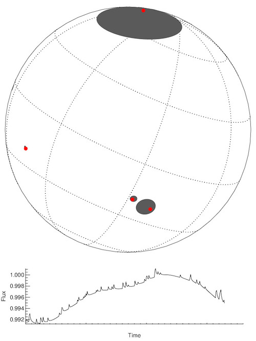

# spots-and-flares

Build a [Phenomenological model](https://en.wikipedia.org/wiki/Phenomenological_model) of spots and flares on a star. Then produce a pretty animation.

- Use the starspot modeling code `STSP` from [Hebb et al](https://github.com/lesliehebb/STSP) to generate a base model.
- Flares a randomly generated with a certain total rate
- Randomly place these flares within the visible hemisphere
- Flare energies are drawn from a power law distribution
- Flare light curves are generated using the [Davenport et al. (2014)](https://github.com/jradavenport/FBEYE) template

