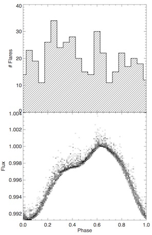

# spots-and-flares

Build a [phenomenological model](https://en.wikipedia.org/wiki/Phenomenological_model) of a stellar light curve with spots and flares:

- Use the starspot modeling code `STSP` from [Hebb et al.](https://github.com/lesliehebb/STSP) to generate a base light curve model.
- Flares are randomly generated at a certain total rate
- Randomly place these flares within the visible hemisphere, OR
- Place flares within a random starspot (default behavior)
- Flare energies are drawn from a power law distribution (e.g. Hawley et al. 2014)
- Flare light curves are generated using the [Davenport et al. (2014)](https://github.com/jradavenport/FBEYE) template
- Generate pretty movie from first rotation. Then continue the model for several more rotations to build up flare statistics, and generate phase-folded diagram. 

*One example frame from the animation, showing starspots (grey) and flares (red).*

*An example of the phase-folded light curve (bottom) and histogram of flares after 10 rotations (top).*